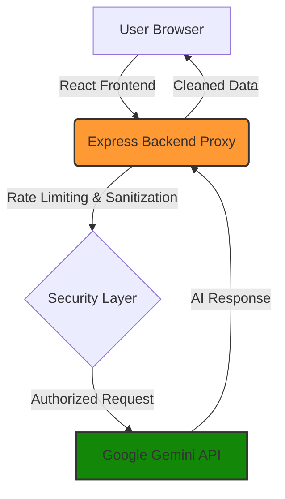
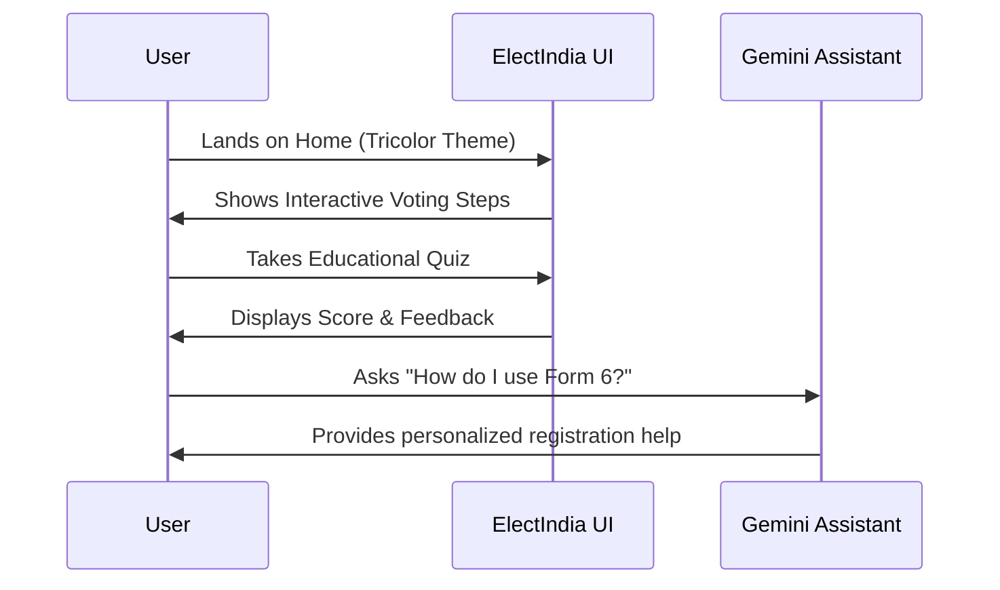

# 🇮🇳 ElectIndia: Interactive Election Guide

[](https://election-web-app-11120183339.us-central1.run.app)
[](https://github.com/Spandan-cyber/Election-Web-App)

**ElectIndia** is a premium, interactive web application designed to bridge the gap between complex democratic procedures and citizen understanding. Built with a stunning Indian tricolor aesthetic, it combines modern web technology with AI-powered guidance to make civic education engaging, accessible, and secure for every Indian voter.

## 📖 Project Overview

In the world's largest democracy, understanding the nuances of the electoral process can be daunting. ElectIndia serves as a digital companion that simplifies this journey. Whether you are a first-time voter looking to register or a seasoned citizen wanting to test your knowledge of the Lok Sabha, this platform provides a centralized, interactive hub for all things election-related.

### The Mission
- **Democratize Knowledge**: Make election rules and procedures easy to digest.
- **Empower First-Time Voters**: Guide the youth through their first democratic milestone.
- **Ensure Security**: Showcase best practices in protecting sensitive API keys through robust backend architecture.

---

## 📊 System Architecture & Flow

### 🏗️ Application Logic
ElectIndia uses a secure proxy architecture to protect AI credentials and ensure smooth performance.



### 🗺️ User Journey
The platform is designed to take users through a logical learning path.



---

## ✨ Key Features

- 🤖 **AI Election Assistant**: A context-aware chatbot powered by **Google Gemini AI** that answers complex questions about voter registration, EVMs, and constitutional processes.
- 🗳️ **Interactive Voting Guide**: A step-by-step visual walkthrough of the voting process in India.
- 🧠 **Educational Quiz**: Test your knowledge of Indian democracy with an interactive scoring system.
- 🗂️ **Election Flashcards**: Quick, bite-sized facts about Indian political history and processes.
- ⏳ **Election Timeline**: Explore the history of general elections in India.
- 🎨 **Premium UI/UX**: Responsive design featuring smooth Framer Motion animations and a sleek Indian flag-inspired theme.
- 🔒 **Secure Backend**: Express.js proxy server ensures API keys remain hidden and includes rate-limiting for security.

---

## 🛠️ Tech Stack

### Frontend
- **React 19** (Vite-powered)
- **Framer Motion** (Animations)
- **Lucide React** (Iconography)
- **Vanilla CSS** (Custom Design System)

### Backend
- **Node.js & Express**
- **Google Generative AI SDK** (Gemini Pro)
- **Dotenv** (Environment Management)

### DevOps
- **Docker** (Containerization)
- **Google Cloud Run** (Serverless Hosting)
- **GitHub Actions** (CI/CD Ready)

---

## 🚀 Getting Started

### Prerequisites
- Node.js (v20+)
- A Google Gemini API Key ([Get one here](https://aistudio.google.com/app/apikey))

### Installation
1. **Clone the repository:**
   ```bash
   git clone https://github.com/Spandan-cyber/Election-Web-App.git
   cd Election-Web-App
   ```

2. **Install dependencies:**
   ```bash
   # Install root/frontend dependencies
   npm install

   # Install server dependencies
   cd server
   npm install
   cd ..
   ```

3. **Configure Environment Variables:**
   Create a `.env` file in the `server` directory:
   ```env
   GEMINI_API_KEY=your_api_key_here
   PORT=3001
   ```

4. **Run the application:**
   ```bash
   # Start the backend (terminal 1)
   cd server
   node index.js

   # Start the frontend (terminal 2)
   npm run dev
   ```

---

## 📦 Deployment

This project is optimized for **Google Cloud Run**.

### Using Docker
The project includes a multi-stage `Dockerfile` that builds the React frontend and serves it via the Express backend.

```bash
gcloud run deploy election-web-app --source . --region us-central1 --allow-unauthenticated
```

---

## 🛡️ Security
- All AI processing is proxied through the backend.
- **Client-side never sees the API key.**
- Built-in rate limiting to prevent API abuse.
- Input sanitization on all user queries.

---

## 🤝 Contributing
Contributions are welcome! Please feel free to submit a Pull Request.

## 📄 License
This project is licensed under the MIT License.

---
*Developed with ❤️ for Indian Democracy.*
